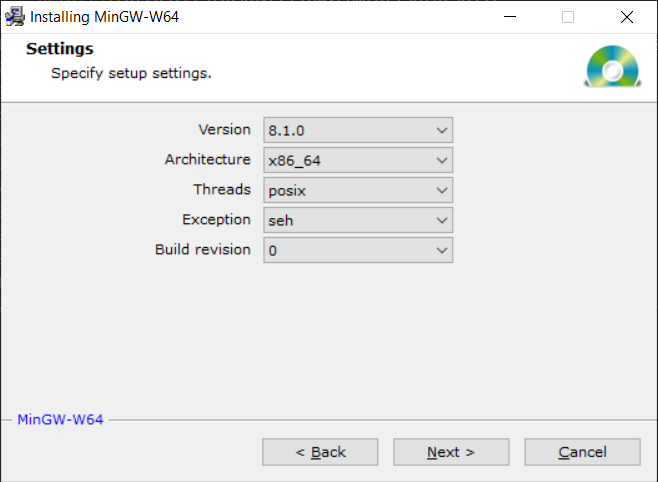
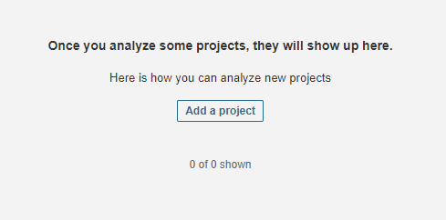
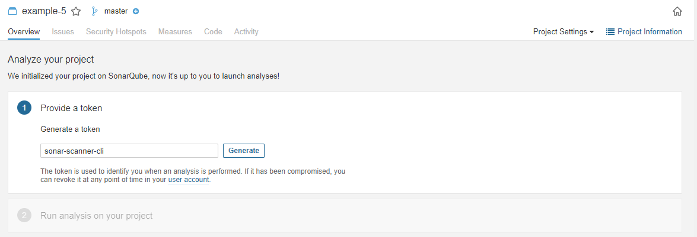

# Basics C++

- [Example 1](example-1)
  - A simple template to build a C++ project.
- [Example 2](example-2)
  - A simple template to build a C++ project, run tests and get code coverage report.
- [Example 3](example-3)
  - A simple template to build a C++ project, run tests with GoogleTest Framework and get code coverage report.
- [Example 4](example-4)
  - A simple template to build a C++ project and run Cppcheck.
- [Example 5](example-5)
  - A simple template to build a C++ project and run SonarQube.
- [Example 6](example-6)
  - A simple C++ project which uses sockets.
- [Example 7](example-7)
  - A simple template to build a C++ project with cross toolchain.
- [Example 8](example-8)
  - A simple C++ project which uses sockets with TLS (OpenSSL), provides encoding/decoding and builds with cross toolchain.

# Table of contents

* [IDE](#ide)
  * [VSCode](#vscode)
* [Windows Setup](#windows-setup)
  * [CMake](#cmake)
  * [MinGW-w64](#mingw-w64)
* [Linux Setup](#linux-setup)
  * [CMake](#cmake-1)
  * [GNU-C++-Compiler](#gnu-c-compiler)
* [Docker Setup](#docker-setup)
* [C++17 Standard](#c17-standard)
* [Project Directory Structure](#project-directory-structure)
* [GoogleTest](#googletest)
  * [Simple Tests](#simple-tests)
  * [Test Fixtures](#test-fixtures)
* [Cppcheck ](#cppcheck)
* [SonarQube](#sonarqube)
  * [Startup](#startup)
  * [Configuration - Add Project](#configuration---add-project)
  * [Configuration - Quality Profiles](#configuration---quality-profiles)
* [Cross Toolchain](#cross-toolchain)
* [OpenSSL](#openssl)

# IDE

## VSCode

Install [VSCode](https://code.visualstudio.com/) as well as the extension [C/C++ extension for VS Code](https://marketplace.visualstudio.com/items?itemName=ms-vscode.cpptools) and configure the IDE:
- [Configuration for Windows](https://code.visualstudio.com/docs/cpp/config-mingw)
- [Configuration for Linux](https://code.visualstudio.com/docs/cpp/config-linux)
- The C++ style is set in `Settings > Extenions > C/C++ > C_Cpp: Clang_format_fallback Style` to `Google`.
- The C++ standard is set in `Settings > Extenions > C/C++ > C_Cpp › Default: Cpp Standard` to `c++17`.

# Windows Setup

## CMake

Download and install [CMake]([https://cmake.org/download/)

Add the install directory (e.g. `C:\Program Files\CMake\bin`) to the `PATH` in a command prompt.

## MinGW-w64

Download [MinGW-w64](https://www.mingw-w64.org/downloads/#mingw-builds) from [https://sourceforge.net/](http://sourceforge.net/projects/mingw-w64/files/Toolchains%20targetting%20Win32/Personal%20Builds/mingw-builds/installer/mingw-w64-install.exe/download).

Execute `mingw-w64-install.exe` to install MinGW-w64.

Select `posix` threads ([more details](https://stackoverflow.com/a/30390278)) and `seh` for exceptions ([more details](https://stackoverflow.com/a/15670258)).

Add the path to your Mingw-w64 bin folder to the Windows PATH environment variable e.g. `C:\Program Files\mingw-w64\x86_64-8.1.0-posix-seh-rt_v6-rev0\mingw64\bin`

Check your MinGW installation:
~~~
> g++ --version
g++.exe (x86_64-posix-seh-rev0, Built by MinGW-W64 project) 8.1.0
Copyright (C) 2018 Free Software Foundation, Inc.
This is free software; see the source for copying conditions.  There is NO
warranty; not even for MERCHANTABILITY or FITNESS FOR A PARTICULAR PURPOSE.
~~~

~~~
> gdb --version
GNU gdb (GDB) 8.1
Copyright (C) 2018 Free Software Foundation, Inc.
License GPLv3+: GNU GPL version 3 or later <http://gnu.org/licenses/gpl.html>
This is free software: you are free to change and redistribute it.
There is NO WARRANTY, to the extent permitted by law.  Type "show copying"
and "show warranty" for details.
This GDB was configured as "x86_64-w64-mingw32".
Type "show configuration" for configuration details.
For bug reporting instructions, please see:
<http://www.gnu.org/software/gdb/bugs/>.
Find the GDB manual and other documentation resources online at:
<http://www.gnu.org/software/gdb/documentation/>.
For help, type "help".
Type "apropos word" to search for commands related to "word".
~~~

# Linux Setup

## CMake

Install [CMake]([https://cmake.org/download/)

~~~
sudo apt-get install cmake
~~~

## GNU-C++-Compiler

Install the GNU-C++-Compiler.

~~~
sudo apt install build-essential
~~~

Check your GNU-C++-Compiler installation:

~~~
$ g++ --version
g++ (Debian 8.3.0-6) 8.3.0
Copyright (C) 2018 Free Software Foundation, Inc.
This is free software; see the source for copying conditions.  There is NO
warranty; not even for MERCHANTABILITY or FITNESS FOR A PARTICULAR PURPOSE.
~~~

~~~
$ gdb --version
GNU gdb (Debian 8.2.1-2+b3) 8.2.1
Copyright (C) 2018 Free Software Foundation, Inc.
License GPLv3+: GNU GPL version 3 or later <http://gnu.org/licenses/gpl.html>
This is free software: you are free to change and redistribute it.
There is NO WARRANTY, to the extent permitted by law.
~~~

# Docker Setup

The project provides docker scripts to build the projects. Read [Get Docker](https://docs.docker.com/get-docker/) for Docker installation instructions.

# C++17 Standard

Standard `C++17` is the informal name for `ISO/IEC 14882:2017` 

# Project Directory Structure

The project structure:

`Project_name`
  - `CMakeLists.txt` - This file is basically a configuration file that tells CMake what to do.
  - `include` - By convention, include directory is for header files, but modern practice suggests that include directory must strictly contain headers that need to be exposed publicly. A thing to note here is the use of another directory inside the include directory. What is even more interesting is that it has a name same as that of your project. The reason to do this is to give a sense of specification when someone tries to use your library. Thus to use your library, one has to use the code `#include <Project_Name/public_header.h>` instead of `#include <public_header.h>` which basically makes it look kind of generalized.
    - `Project_name`
  - `src` - This directory basically contains all the source code and the header files that are for internal use only. All the code that you library/project consists of must go in here.
    - `CMakeLists.txt` - This file is basically a configuration file that tells CMake what to do.
    - `private_header(s).h`
    - `code(s).cpp`
  - `libs` - This directory consists all the third party libraries that are need by your project. Usually if you look into any of the third party libraries present here, they would be following a similar structure that you are using for your project. A point to note is there are two ways of using third party libraries in C++ - static and dynamic. This lib directory is only for static ones. 
    - `A`
      - `CMakeLists.txt` - This file is basically a configuration file that tells CMake what to do.
    - `B`
      - `CMakeLists.txt` - This file is basically a configuration file that tells CMake what to do.
  - `tests` - As the name suggests, code for unit testing is kept in this directory.
    - `CMakeLists.txt` - This file is basically a configuration file that tells CMake what to do.

# GoogleTest

The assertions come in pairs that test the same thing but have different effects on the current function.
`ASSERT_*` versions generate fatal failures when they fail, and abort the current function.
`EXPECT_*` versions generate nonfatal failures, which don’t abort the current function.
Usually `EXPECT_*` are preferred, as they allow more than one failure to be reported in a test.
However, you should use `ASSERT_*` if it doesn’t make sense to continue when the assertion in question fails.

## Simple Tests

~~~
#include <gtest/gtest.h>

TEST(TestSuiteName, TestName) {
  ... test body ...
}
~~~

Visit [Assertions Reference](https://google.github.io/googletest/reference/assertions.html) for possible macros.
- Explicit Success and Failure
  - SUCCEED()
  - FAIL()
  - ADD_FAILURE()
  - ADD_FAILURE_AT(file_path,line_number)
- Generalized Assertion
  - EXPECT_THAT(value,matcher)
- Boolean Conditions
  - EXPECT_TRUE(condition)
  - EXPECT_FALSE(condition)
- Binary Comparison
  - EXPECT_EQ(val1,val2)
  - EXPECT_NE(val1,val2)
  - EXPECT_LT(val1,val2)
  - EXPECT_LE(val1,val2)
  - EXPECT_GT(val1,val2)
  - EXPECT_GE(val1,val2)
- String Comparison
  - EXPECT_STREQ(str1,str2)
  - EXPECT_STRNE(str1,str2)
  - EXPECT_STRCASEEQ(str1,str2)
  - EXPECT_STRCASENE(str1,str2)
- Floating-Point Comparison
  - EXPECT_FLOAT_EQ(val1,val2)
  - EXPECT_DOUBLE_EQ(val1,val2)
  - EXPECT_NEAR(val1,val2,abs_error)
- Exception Assertions
  - EXPECT_THROW(statement,exception_type)
  - EXPECT_ANY_THROW(statement)
  - EXPECT_NO_THROW(statement)

## Test Fixtures

For each test defined with `TEST_F()`, googletest will create a fresh test fixture at runtime, immediately initialize it via `SetUp(`), run the test, clean up by calling `TearDown()`, and then delete the test fixture.
Note that different tests in the same test suite have different test fixture objects, and googletest always deletes a test fixture before it creates the next one.
googletest does not reuse the same test fixture for multiple tests.
Any changes one test makes to the fixture do not affect other tests.

First, define a fixture class.
By convention, you should give it the name `FooTest` where `Foo` is the class being tested.
~~~
class FooTest : public ::testing::Test {
protected:
  void SetUp() override {
    // initialize test class
    q1_.Enqueue(1);
    q2_.Enqueue(2);
    q2_.Enqueue(3);
  }

  void TearDown() override {
    // cleans up after the test finishes.
  }

  Queue<int> q0_;
  Queue<int> q1_;
  Queue<int> q2_;
};
~~~

Write tests using `TEST_F()` and this fixture.
~~~
TEST_F(FooTest, IsEmptyInitially) {
  EXPECT_EQ(q0_.size(), 0);
}
~~~

# Cppcheck 

Install Cppcheck with
~~~
sudo apt install cppcheck
~~~

# SonarQube

You can start a new instance of SonarQube with the [docker script](docker-sonarqube/docker.sh).

The SonarQube server already contains the [C++ plugin](https://github.com/SonarOpenCommunity/sonar-cxx) which is compatible to the [SonarQube version](https://github.com/SonarOpenCommunity/sonar-cxx/wiki/Compatibility-Matrix).

## Startup

Once your instance is up and running, Log in to http://localhost:9000 using System Administrator credentials:
- user: `admin`
- password: `admin`

Change the admin password:

Accept the risk of external plugins:

Navigate to `Administration -> Marketplace` and make sure that the plugins `C++ (Community)` is installed.

Additional configuration can be done under `Administration -> Configuration -> General Settings` within the `C++ (Community)` areas.

## Configuration - Add Project

Create a new project.

Select `Manually`:

Set key and name:

Create a token for the sonar scanner:

Copy the token and pass it on to the `sonarqube.sh` script. See `example-5`.

## Configuration - Quality Profiles

You need to enable for which kinds of problems both plugins should scan. This needs to be done initially, as otherwise they will not detect anything by default.

Go to `Quality Profiles`, click on the downwards arrow next to the `Sonar way (Built-in)` profile within the `CXX` area. Click `Copy`. Give it a catchy name, like `Sonar way - CXX`

A new quality profile pops up, you see the Rules (Bugs, Vulnerabilities, Code Smells) in the left table. You can click `Activate more rules`.

In the next table, you see the rules sorted by the same types.
You can click all three types on the left side and mark them this way - if you want and then click on `Bulk Change` and `Activate In "Sonar way - CXX"` to activate all rules within our newly created Quality Profile.
You have to acknowledge the change and SonarQube will report back as soon as the changes are done.

Save the changes:

You can now navigate back to Quality Profiles, click on the downwards arrow next to the `Sonar way - CXX` profile within the `C++ (Community)` area and click on `Set as Default`.
With this change, your newly created profile will now be used for the next scans.

You can also select the profile for each project in the project settings.

# Cross Toolchain

Install `amd64` toolchain:
~~~
sudo apt install crossbuild-essential-amd64
~~~

Install `armel` toolchain:
~~~
sudo apt install crossbuild-essential-armel
~~~

Install `armhf` toolchain:
~~~
sudo apt install crossbuild-essential-armhf
~~~

Install `arm64` toolchain:
~~~
sudo apt install crossbuild-essential-arm64
~~~

Install `mingw-w64` Windows 32-Bit and 64-Bit toolchain:
~~~
sudo apt install mingw-w64
~~~

# OpenSSL

You can install the [OpenSSL](https://www.openssl.org/) for development with the below command:
~~~
sudo apt install openssl libssl-dev
~~~

You can also build OpenSSL from [source](github.com/openssl/openssl) (see [example 8](example-8)).