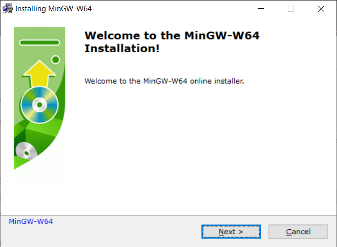
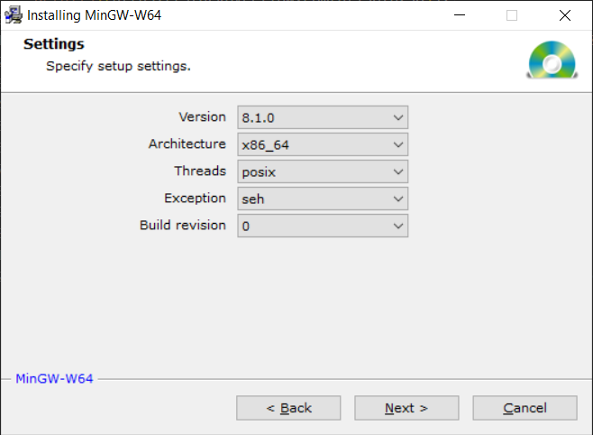
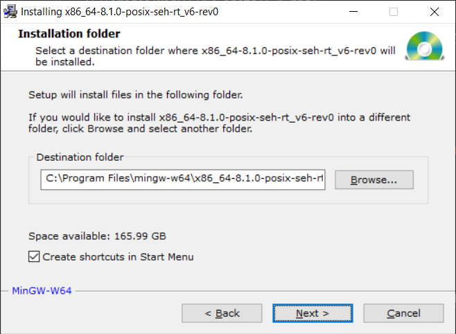

# Basics C++ - Example 1

# Table of Contents

* [IDE](#ide)
* [Windows Setup](#windows-setup)
* [Linux Setup](#linux-setup)
* [C++17 Standard](#c17-standard)
* [Project Directory Structure](#project-directory-structure)
* [Build Project](#build-project)
* [Install Project](#install-project)

# IDE

## VSCode

Install [VSCode](https://code.visualstudio.com/) as well as the extension [C/C++ extension for VS Code](https://marketplace.visualstudio.com/items?itemName=ms-vscode.cpptools) and configure the IDE:
- [Configuration for Windows](https://code.visualstudio.com/docs/cpp/config-mingw)
- [Configuration for Linux](https://code.visualstudio.com/docs/cpp/config-linux)

# Windows Setup

## CMake

Download and install [CMake]([https://cmake.org/download/)

Add the install directory (e.g. `C:\Program Files\CMake\bin`) to the `PATH` in a command prompt.

## MinGW-w64

Download [MinGW-w64](https://www.mingw-w64.org/downloads/#mingw-builds) from [https://sourceforge.net/](http://sourceforge.net/projects/mingw-w64/files/Toolchains%20targetting%20Win32/Personal%20Builds/mingw-builds/installer/mingw-w64-install.exe/download).

Execute `mingw-w64-install.exe` to install MinGW-w64.

Select `posix` threads ([more details](https://stackoverflow.com/a/30390278)) and `seh` for exceptions ([more details](https://stackoverflow.com/a/15670258)).

Add the path to your Mingw-w64 bin folder to the Windows PATH environment variable e.g. `C:\Program Files\mingw-w64\x86_64-8.1.0-posix-seh-rt_v6-rev0\mingw64\bin`

Check your MinGW installation:
~~~
> g++ --version
g++.exe (x86_64-posix-seh-rev0, Built by MinGW-W64 project) 8.1.0
Copyright (C) 2018 Free Software Foundation, Inc.
This is free software; see the source for copying conditions.  There is NO
warranty; not even for MERCHANTABILITY or FITNESS FOR A PARTICULAR PURPOSE.
~~~

~~~
> gdb --version
GNU gdb (GDB) 8.1
Copyright (C) 2018 Free Software Foundation, Inc.
License GPLv3+: GNU GPL version 3 or later <http://gnu.org/licenses/gpl.html>
This is free software: you are free to change and redistribute it.
There is NO WARRANTY, to the extent permitted by law.  Type "show copying"
and "show warranty" for details.
This GDB was configured as "x86_64-w64-mingw32".
Type "show configuration" for configuration details.
For bug reporting instructions, please see:
<http://www.gnu.org/software/gdb/bugs/>.
Find the GDB manual and other documentation resources online at:
<http://www.gnu.org/software/gdb/documentation/>.
For help, type "help".
Type "apropos word" to search for commands related to "word".
~~~

# Linux Setup

## CMake

Install [CMake]([https://cmake.org/download/)

~~~
sudo apt-get install cmake
~~~

## GNU-C++-Compiler

Install the GNU-C++-Compiler.

~~~
sudo apt install build-essential
~~~

Check your GNU-C++-Compiler installation:

~~~
$ g++ --version
g++ (Debian 8.3.0-6) 8.3.0
Copyright (C) 2018 Free Software Foundation, Inc.
This is free software; see the source for copying conditions.  There is NO
warranty; not even for MERCHANTABILITY or FITNESS FOR A PARTICULAR PURPOSE.
~~~

~~~
$ gdb --version
GNU gdb (Debian 8.2.1-2+b3) 8.2.1
Copyright (C) 2018 Free Software Foundation, Inc.
License GPLv3+: GNU GPL version 3 or later <http://gnu.org/licenses/gpl.html>
This is free software: you are free to change and redistribute it.
There is NO WARRANTY, to the extent permitted by law.
~~~

# C++17 Standard

Standard `C++17` is the informal name for `ISO/IEC 9899:2018` 

# Project Directory Structure

The project structure:

`Project_name`
  - `CMakeLists.txt` - This file is basically a configuration file that tells CMake what to do.
  - `include` - By convention, include directory is for header files, but modern practice suggests that include directory must strictly contain headers that need to be exposed publicly. A thing to note here is the use of another directory inside the include directory. What is even more interesting is that it has a name same as that of your project. The reason to do this is to give a sense of specification when someone tries to use your library. Thus to use your library, one has to use the code `#include <Project_Name/public_header.h>` instead of `#include <public_header.h>` which basically makes it look kind of generalized.
    - `Project_name`
  - `src` - This directory basically contains all the source code and the header files that are for internal use only. All the code that you library/project consists of must go in here.
    - `CMakeLists.txt` - This file is basically a configuration file that tells CMake what to do.
    - `private_header(s).h`
    - `code(s).cpp`
  - `libs` - This directory consists all the third party libraries that are need by your project. Usually if you look into any of the third party libraries present here, they would be following a similar structure that you are using for your project. A point to note is there are two ways of using third party libraries in C++ - static and dynamic. This lib directory is only for static ones. 
    - `A`
      - `CMakeLists.txt` - This file is basically a configuration file that tells CMake what to do.
    - `B`
      - `CMakeLists.txt` - This file is basically a configuration file that tells CMake what to do.
  - `tests` - As the name suggests, code for unit testing is kept in this directory.
    - `CMakeLists.txt` - This file is basically a configuration file that tells CMake what to do.

# Build Project

Execute the `build.bat` on Windows or `build.sh` on Linux.

# Install Project

Execute the `build.sh` on Linux. There is no support for Windows yet.